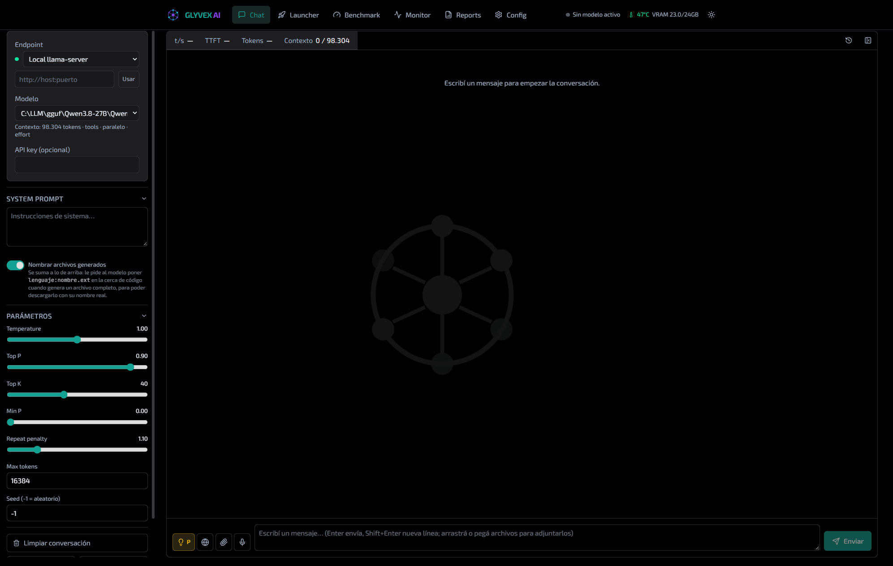
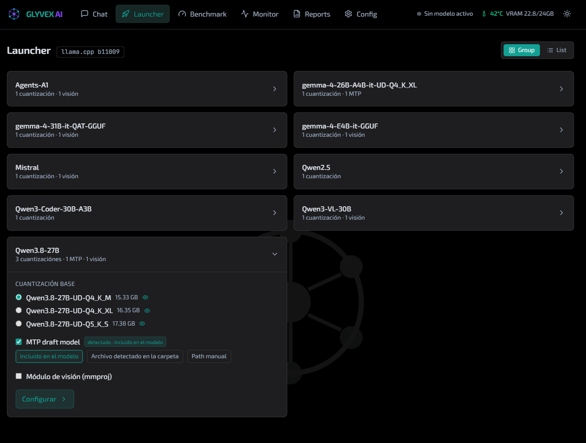
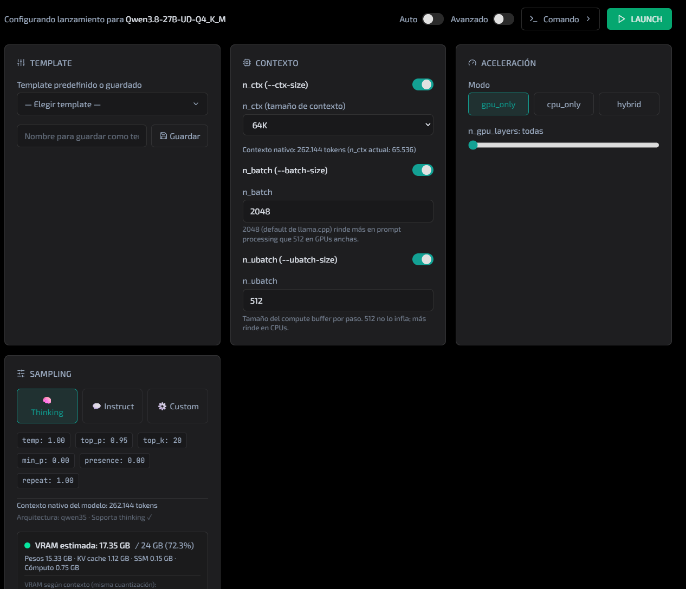
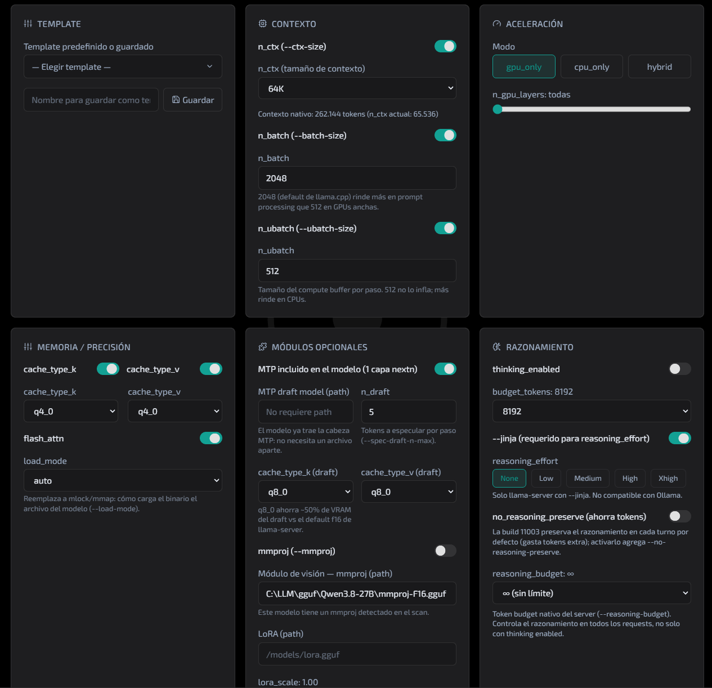
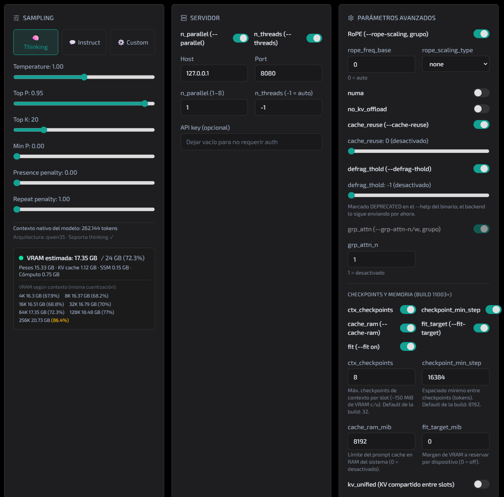
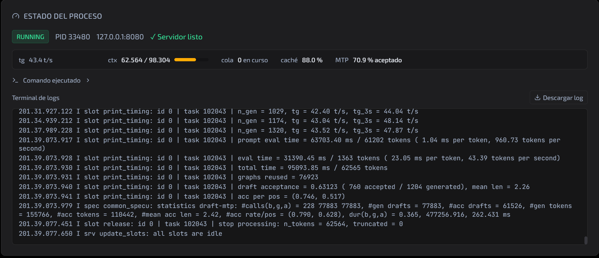
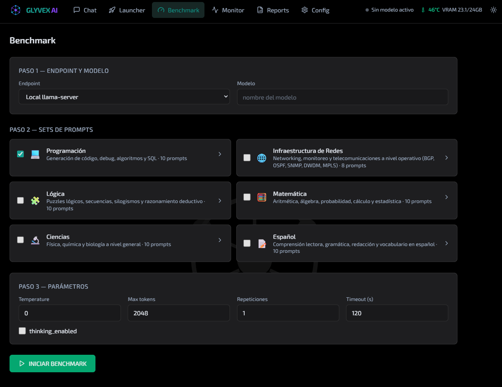
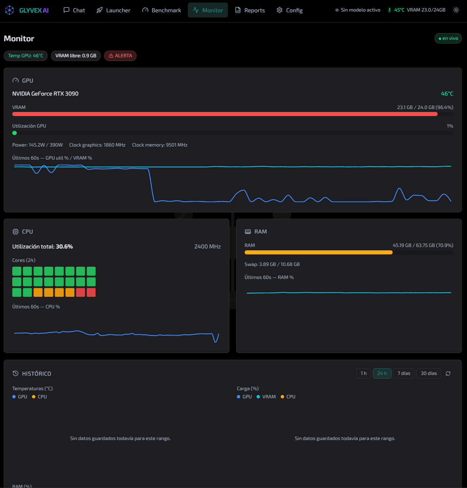
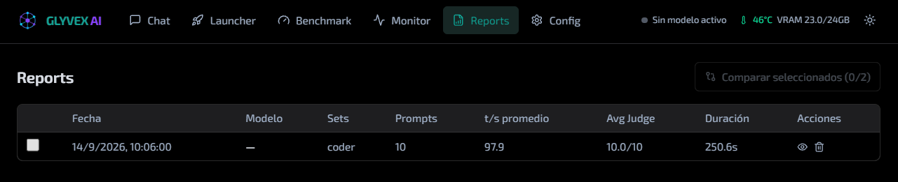
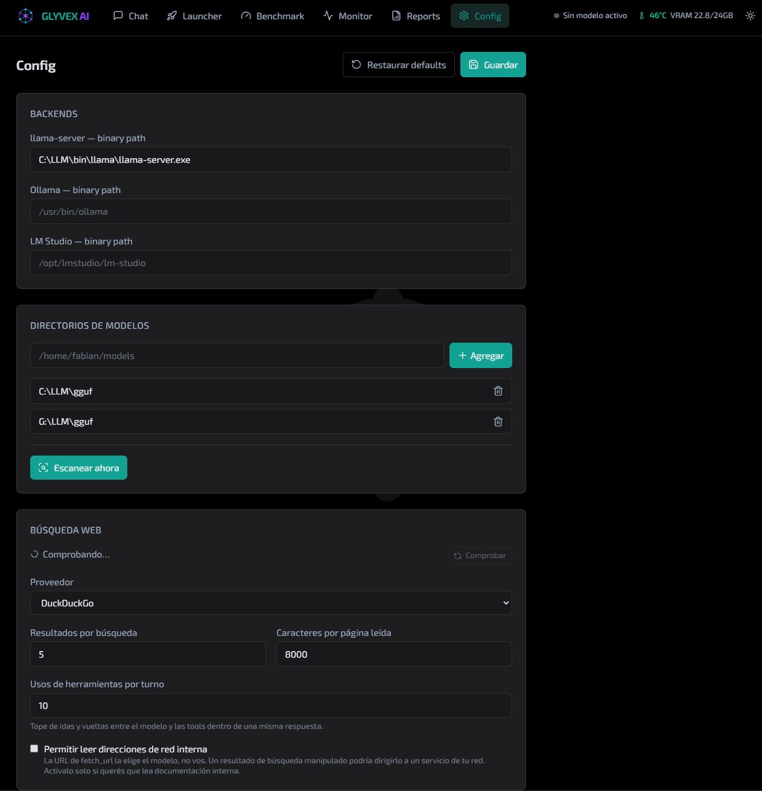

# Glyvex-AI-Suite

🌐 *Languages / Idiomas:* **English** | [Español](README.es.md)

[](LICENSE)
[](https://www.python.org/)
[](https://nodejs.org/)

**Glyvex-AI-Suite** is a local application — part of **Glyvex Group** — to
manage, launch, chat with, and evaluate local LLM models (GGUF/GGML via
llama-server, Ollama, LM Studio) without relying on any cloud service.
Everything runs on your own machine: the model inventory, the processes, the
conversations and the benchmarks stay on your disk.

Optimized for **NVIDIA GPUs (CUDA)**, but that's not a requirement: it runs
on pure CPU on any modern machine, the GPU only speeds up large models, and
the Launcher's hardware templates adapt the load to what the machine has.
Without an NVIDIA GPU, the Monitor and the Launcher degrade gracefully
(see the Modules section).

**Product site:** [ai-suite.glyvexgroup.com](https://ai-suite.glyvexgroup.com/) — [Glyvex AI Division](https://ai.glyvexgroup.com/)

## Screenshots

| | |
|---|---|
| <br><sub>Chat: streaming, reasoning and live metrics (t/s, TTFT)</sub> | <br><sub>Launcher: model inventory grouped by folder</sub> |
| <br><sub>Launcher: launch options</sub> | <br><sub>Launcher: advanced options</sub> |
| <br><sub>Launcher: advanced options (MTP, context)</sub> | <br><sub>Launcher: online backends</sub> |
| <br><sub>Benchmark: run results</sub> | <br><sub>Monitor: GPU, CPU and LLM server vitals</sub> |
| <br><sub>Reports: benchmark history</sub> | <br><sub>Config: general settings</sub> |

## Requirements

- **Python 3.11+**
- **Node.js 20 LTS+** (for the Vite/React frontend)
- **NVIDIA drivers + CUDA** — *optional*. Without an NVIDIA GPU, the Monitor
  (M5) shows "GPU NVIDIA no detectada" instead of crashing, and the rest of
  the suite works the same (you can run models 100% on CPU).
- `faster-whisper` — *optional*, for local voice transcription of the chat
  microphone: `pip install -r requirements-optional.txt`
  (see [`docs/voz-a-texto.md`](docs/voz-a-texto.md), in Spanish).
- At least one of these inference backends, depending on what you'll use.
  **On Windows** there's also the [embedded runtime](#inference-runtime-embedded-llamacpp):
  the suite downloads its own tested build of llama.cpp, so you don't have to
  install anything separate. Otherwise, [`llama-server`](https://github.com/ggml-org/llama.cpp)
  (from llama.cpp), [Ollama](https://ollama.com), or [LM Studio](https://lmstudio.ai)
  running in server mode.

## Platforms

| Platform | Status | Notes |
|---|---|---|
| **Windows** | ✅ Development & testing | `start.cmd` (CMD) and `start.ps1` (PowerShell) scripts. |
| **Linux** | ⏳ Coming soon | `start.sh` already exists; formal support (full testing and CI) is on the roadmap. |
| **macOS** | ⏳ Coming soon | Shares `start.sh`; not tested in the current cycle. |

## Installation

### 1. Backend

```bash
# From the repository root
python3 -m venv .venv
source .venv/bin/activate        # Windows: .venv\Scripts\activate
pip install -r requirements.txt
```

### 2. Frontend

```bash
cd frontend
npm install
```

### 3. Development start (2 processes, with hot-reload)

Terminal 1 — backend:

```bash
cd backend
uvicorn main:app --reload --port 7981
```

Terminal 2 — frontend:

```bash
cd frontend
npm run dev
```

Open `http://localhost:5173`.

### 4. All-in-one start (local production)

Linux/macOS:

```bash
./start.sh
```

Windows (CMD or PowerShell):

```bat
start.cmd
```
```powershell
.\start.ps1
```

They compile the frontend to `frontend/dist` (if it doesn't exist) and start
`uvicorn` on `127.0.0.1:7981`, serving the compiled SPA from `/`. All three
scripts honor `GLYVEX_PORT` and `GLYVEX_HOST` (the default bind is
`127.0.0.1`; exposing it to the network is deliberately opt-in, with
`GLYVEX_HOST=0.0.0.0`, and requires authentication — see the Security
section).

### 5. Multiple instances on the same machine

You can run a second instance (e.g. to test changes without touching the real
data) with the `--env` flag:

```bash
./start.sh --env testing        # Linux/macOS
start.cmd --env testing         # Windows CMD
.\start.ps1 -Env testing        # PowerShell
```

Each environment is defined in a file under `environments/`:

| | `production.env` | `testing.env` |
|---|---|---|
| Backend | `127.0.0.1:7981` | `127.0.0.1:22222` |
| Dev server (Vite) | `:5173` | `:25173` |
| Data | `./data` | `./data-testing` |

**To move an instance to a different port, you touch a single file.**
`vite.config.js` reads the same `environments/<name>.env`, so changing
`GLYVEX_PORT` and `GLYVEX_DEV_PORT` there aligns the backend, the dev server
`/api` proxy and the CORS. (Remember to also update `GLYVEX_CORS_ORIGINS`,
which must list that instance's `GLYVEX_DEV_PORT`.)

Variables that define each environment:

| Variable | Purpose |
|---|---|
| `GLYVEX_ENV` | Environment name. Informational: it appears in the startup log. |
| `GLYVEX_HOST` / `GLYVEX_PORT` | uvicorn bind. |
| `GLYVEX_DEV_PORT` | Vite dev server port. Not used by the backend. |
| `GLYVEX_DATA_DIR` | Where the instance's state lives (relative to the repo root, or absolute). |
| `GLYVEX_CORS_ORIGINS` | Allowed origins, comma-separated. |

All of an instance's state hangs off its `GLYVEX_DATA_DIR`: `config.json`,
`glyvex.db`, `metrics.db`, `attachments/`, `logs/`, `benchmarks/`. The only
things shared between instances are the read-only files versioned in the
repo: the prompt sets (`backend/prompts/`) and the hardware template seed
(`data/templates/hw_templates.json`).

In development mode, the testing instance's frontend starts with Vite's mode
system:

```bash
cd frontend && npm run dev -- --mode testing
```

With no `GLYVEX_*` variable defined, everything behaves as before:
`DATA_DIR` is `./data` and the port is 7981.

## Quick start (4 steps)

If it's the first time you open the app with an empty `config.json` (or with
no file at all, which is generated with the defaults; see
`data/config.example.json` for the full reference), you'll see an onboarding
screen with these same steps and live checkmarks.

1. **Configure** — in `/config`, set the `binary_path` of `llama-server`
   (and/or Ollama/LM Studio) and add at least one directory with your
   `.gguf`/`.safetensors` models.
2. **Scan** — on the same screen, click "Escanear ahora". The inventory is
   saved to `data/models.json` and becomes available in the Launcher.
3. **Launch** — in `/launcher`, pick a model (Group view groups by folder
   with its MTP/mmproj variants, or switch to List view), tune the
   context/GPU parameters if needed, and click **LAUNCH**.
4. **Chat** — in `/` (Chat), the endpoint of the just-launched model appears
   automatically in the selector. Type and go — the response arrives in
   streaming, token by token.

From there you can also run a full benchmark (`/benchmark`) against the
active model, or watch its HW usage live (`/monitor`).

## Inference runtime (embedded llama.cpp)

On **Windows** the suite can bring its own tested build of
[llama.cpp](https://github.com/ggml-org/llama.cpp) so you don't have to
install any inference software: pin **b11009**, flat layout, in two levels:

- **base engine** (~19 MB): runs on any GPU/CPU.
- **acceleration** (~531 MB for NVIDIA + CUDA 13.4; the AMD/Intel one comes
  in phase B). It's picked based on the detected GPU family.

- **Where it lives:** `<DATA_DIR>/runtime/llama.cpp-b11009/` (exe + DLLs in
  the same folder, because `llama-server.exe` looks for its DLLs in its own
  directory). It's not part of the repo: it's downloaded on demand and
  verified with **sha256**.
- **How you get it:** it's an explicit act — the **Download runtime** button
  in onboarding (with the detected GPU and the estimated size) or in
  `/config` → **Runtime** card. It never downloads by itself.
- **States:** `missing` → `downloading` (progress via SSE, in 2 stages: base
  and acceleration) → `ready` (check + pin; it can end up "degraded" if the
  acceleration didn't install: it runs on CPU, never an error) / `error`
  (message + Retry) / `unsupported` (other platforms; v1 is Windows-only).
- **Cascade at launch:** the expert-mode `binary_path` always wins; if not,
  it uses the managed runtime when it's `ready`; if there's none, the launch
  is rejected with `runtime_missing` and the UI offers "Download runtime".
- **Reinstall:** **Reinstall** in Config = reset (deletes the folder) +
  downloads again. API: `GET /api/runtime/status`,
  `POST /api/runtime/download` (SSE), `POST /api/runtime/reset`.
- **v1:** the base engine is offered on all Windows; GPU acceleration is
  NVIDIA/CUDA today, and AMD/Intel (Vulkan/ROCm) comes in phase B — until
  then those GPUs run on CPU with a note in the UI. Expert mode
  (`binary_path`) keeps working the same on any platform.

The Launcher manages the full lifecycle of the process: it starts, monitors
and stops `llama-server` for you. It does not attach to servers running
outside the app yet.

## Views

| Route | View | Content |
|-------|------|---------|
| `/` | Chat | Streaming, branches (regenerations), attachments, mic, reasoning, metrics, export, history |
| `/launcher` | Launcher | Group/List views, hardware templates, sampling presets, launch/stop, live logs, process vitals strip (t/s, context, queue) |
| `/benchmark` | Benchmark | Set selection (including your own), cancellable run, WS progress, results |
| `/monitor` | Monitor | GPU card, core heatmap, 60 s sparklines, **LLM Server** section (live vitals + per-process history of t/s, context and queue), HW history chart with retention, WS connection indicator |
| `/reports` | Reports | Benchmark history, Recharts charts (t/s per prompt, TTFT vs tokens), comparison, HTML reports |
| `/config` | Config | Backend, model_dirs, scan, tools, STT, attachments, templates, monitor (history and retention) |

## Modules

| Module | What it does |
|--------|--------------|
| **M0 — Skeleton** | Project base: FastAPI + React + persisted config. |
| **M1 — Inventory** | Scans your `.gguf` files, extracts family/quantization, reads GGUF metadata, detects embedded modules (MTP/vision), groups by folder. |
| **M2 — Launcher** | Launches `llama-server`/Ollama/LM Studio with hardware templates, live logs, MTP/draft and clean stop/restart. |
| **M3 — Chat** | Streaming with separate reasoning, live metrics, branches, attachments, tool calling, voice to text. |
| **M4 — Benchmark** | 58 prompts in 6 categories + your own sets, scoring, HTML reports, run comparison. |
| **M5 — Monitor** | Real-time GPU (with power limit/TDP control)/CPU/RAM + persistent history with configurable retention. |
| **M6 — Integration** | Status widget in the navbar, toasts, shortcuts, onboarding. |
| **M7 — Database** | Async SQLite: conversations (tree), benchmarks, templates, sets. |
| **M8 — LLM server vitals** | t/s, prompt processing, cache, MTP acceptance % from `llama-server`'s `/metrics`. |

Per-module technical detail: [`docs/modulos.md`](docs/modulos.md) (Spanish) ·
Launch parameters: [`docs/launcher-params.md`](docs/launcher-params.md)
(Spanish)

## Keyboard shortcuts (Chat)

| Shortcut | Action |
|----------|--------|
| `Enter` | Send message |
| `Shift+Enter` | New line |
| `Ctrl+Enter` (or `Cmd+Enter`) | Send message (global alternative) |
| `Esc` | Cancel the in-progress generation |
| `Ctrl+L` | Clear the conversation (asks for confirmation) |
| `Ctrl+E` | Show/hide the export panel |

## Model tools (chat)

The chat exposes two tools to the model, invoked natively via `tool_calls`
(rounds limited by `tools.max_rounds` in `/config`):

- **Web search** — default provider **DuckDuckGo (ddgs)**: no server, no API
  key, no Docker. Optional providers: **SearXNG** (local, via HTTP), **Brave**
  and **Tavily** (API keys via env var `BRAVE_API_KEY`/`TAVILY_API_KEY` or
  via config).
- **URL fetch** — configurable character limits, timeout and user-agent,
  content extraction with trafilatura/readability, and **private hosts
  blocked by default** (`tools.allow_private_hosts`).
- `GET /api/chat/tools/status` tells the frontend which providers are active.

## Documentation

> Note: the detailed docs below are currently in **Spanish**.

| Where to go | What you'll find |
|---|---|
| [README](README.md) | Full overview: modules (M0–M8), install, usage, security and release. |
| [`docs/QUICKSTART.md`](docs/QUICKSTART.md) | The shortest path to a running suite: prerequisites, install, startup and first run. |
| [`docs/ARQUITECTURA.md`](docs/ARQUITECTURA.md) | Codebase map: processes, data flows and where state lives. |
| [`docs/PRIVACIDAD.md`](docs/PRIVACIDAD.md) | What leaves your machine and what doesn't: 100% local, no outbound telemetry. |
| [`docs/modulos.md`](docs/modulos.md) | Per-module technical detail (M0–M8). |
| [`docs/launcher-params.md`](docs/launcher-params.md) | Reference of the `llama-server` launch parameters the Launcher manages. |
| [`docs/LAUNCH-FLAGS.md`](docs/LAUNCH-FLAGS.md) · [`docs/LAUNCH-FLAGS.es.md`](docs/LAUNCH-FLAGS.es.md) | Bilingual (EN/ES) guide for every flag: what it does, impact, default and when to change it. The Launcher shows the binary's official help under each control. |
| [`docs/voz-a-texto.md`](docs/voz-a-texto.md) | Chat microphone: Web Speech API vs local Whisper, models, security and packaging. |
| [`docs/TROUBLESHOOTING.md`](docs/TROUBLESHOOTING.md) | Common problems and how to solve them. |
| [`docs/searxng/README.md`](docs/searxng/README.md) | Web search providers (DuckDuckGo, SearXNG, Brave, Tavily) and `tools.*`. |
| [`CONTRIBUTING.md`](CONTRIBUTING.md) | How to contribute: branches, commits, tests and conventions. |

## Security

- **100% local by design**: conversations, inventory and benchmarks never
  leave the machine; the only network egress is the web search/fetch of the
  model tools.
- **Embedded runtime** — the optional download of the llama.cpp runtime is
  the only exception to "everything is local": it's **explicit** (you start
  it), **sha256-verified** against a list of tested versions, and the app
  never downloads anything on its own. See [PRIVACIDAD](docs/PRIVACIDAD.md).
- CORS is restricted to whatever you list in `GLYVEX_CORS_ORIGINS` in the
  active environment (default `http://localhost:5173`). With
  `allow_credentials=True`, a `*` doesn't work: browsers reject that
  combination, so origins must be listed one by one.
- `fetch_url` blocks private hosts by default.
- `data/config.json` is **not committed** (it's in `.gitignore`); the
  template is in `data/config.example.json`. API keys (`brave_api_key`,
  `tavily_api_key`) are read from the environment variables
  `BRAVE_API_KEY`/`TAVILY_API_KEY` first; if you write them in
  `config.json` they stay only on your machine.
- The server listens on `127.0.0.1` by default (local app, no
  authentication). To expose it to the network you have to do it
  deliberately: `GLYVEX_HOST=0.0.0.0 ./start.sh` — and in that case, **don't
  do it without authentication**.
- The launcher's `log_file` is validated against path traversal (400 if it
  ends up outside `BASE_DIR`).

## Roadmap

- [x] **M0** — Project skeleton
- [x] **M1** — Model management (scanner and inventory)
- [x] **M2** — Model launcher
- [x] **M3** — Chat interface
- [x] **M4** — Benchmark suite
- [x] **M5** — Hardware resources monitor
- [x] **M6** — Final integration and polish
- [x] **M7** — SQLite database (conversations, benchmarks, templates, sets)
- [x] **M8** — LLM server vitals (Prometheus `/metrics`, history in `metrics.db`)
- [ ] GPU acceleration for AMD/Intel in the embedded runtime (Vulkan/ROCm, phase B — for now it runs on CPU)
- [ ] Formal Linux (and macOS) support: full testing and CI

## Tests

Automated test suite (pytest + pytest-asyncio + httpx, 356 tests, no
unittest, no requests, no GPU/models/real network — everything mocked: mock
LLM server uvicorn on `:18080`, fake binaries, in-memory SQLite):

```bash
# Install test dependencies
pip install pytest>=8.0 pytest-asyncio>=0.24 pytest-mock>=3.14 httpx>=0.27 anyio>=4.0 pytest-cov

# Run all tests (from the repository root)
pytest tests/ -v

# A specific module
pytest tests/test_models.py -v

# With coverage
pytest tests/ --cov=backend --cov-report=term-missing --cov-report=html
```

## Versioning

The suite uses [SemVer](https://semver.org/lang/en/). The version lives in
`backend/main.py` (`APP_VERSION`, exposed on `/api/health` and `/api/info`)
and is kept in sync with annotated git tags `vX.Y.Z`:

- **MAJOR** — breaking changes in data schemas (`config.json`, `glyvex.db`, `metrics.db`) or the internal API.
- **MINOR** — new modules/features (M8, tools, backends).
- **PATCH** — fixes and polish.

To make a release:

```bash
# 1. Bump APP_VERSION in backend/main.py and commit
# 2. Full suite green
pytest tests/ -q
# 3. Annotated tag + push
git tag -a vX.Y.Z -m "<release summary>"
git push origin main vX.Y.Z
```

## License

Apache License 2.0 — see [LICENSE](LICENSE).

Copyright (c) 2026 Glyvex Group

The suite is distributed under **Apache 2.0** for the community. The
**Enterprise** editions (Glyvex Suite) are separately licensed under a
commercial agreement with Glyvex Group.
